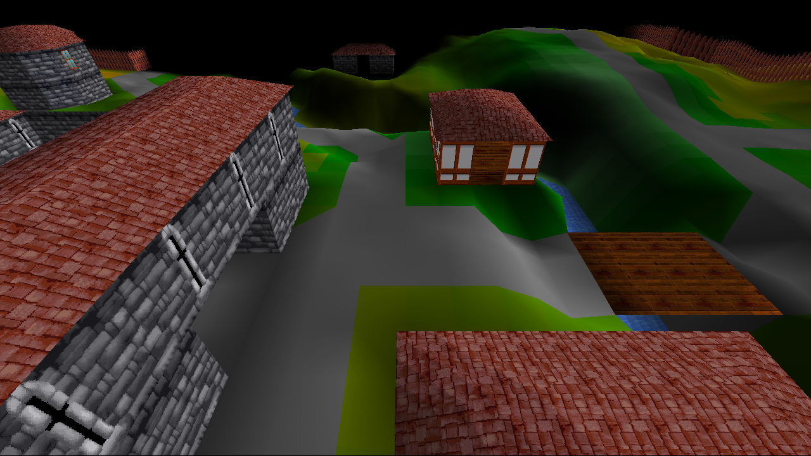

# RSC Remastered

*(Formerly OpenRSC)*

An open-source re-implementation of RuneScape Classic for private use.

## :dart: Aim

The primary aim of this project is to **deobfuscate**, **refactor** and **modernize** the RuneScape Classic client.

While other projects have had great success in deobfuscating the source code, it is still very messy and difficult to understand, due to the nature of the decompilation process. The original game was also constrained by the need to run on old hardware and primitive web browsers.

Refactoring it can make it significantly easier to read and maintain the code, as shown by [this example](docs/example_refactor.md). This could pave the way for all sorts of future enhancements, and perhaps ports to other platforms.

 > See **[about](docs/about.md)** for more information.

## :hammer: Build

The project should work out-of-the-box with Eclipse.

The client and server should be built separately. Be sure to include the provided `libs` and the `res` folder!

## :chart_with_upwards_trend: Progress

:heavy_check_mark: Loading screen\
:heavy_check_mark:️ Title screen\
:heavy_check_mark:️ Dynamic world loading\
:heavy_check_mark:️ Camera rotation\
:heavy_check_mark:️ Landscape rendering\
:heavy_check_mark:️ Wall rendering\
:heavy_check_mark:️ Roof rendering\
:x: Door rendering\
:x: Model rendering (e.g. trees, fountains)\
:x: Mob rendering\
:x: User interface

> See **[ideas](docs/ideas.md)** for planned enhancements.

## :video_game: Controls

**Left Click:** Teleport\
**Left / Right:** Rotate camera\
**Page Up:** Go up a layer\
**Page Down:** Go down a layer

## :page_with_curl: Disclaimer

The game data and original RuneScape source code referred to here is the intellectual property of *Jagex Ltd*.
